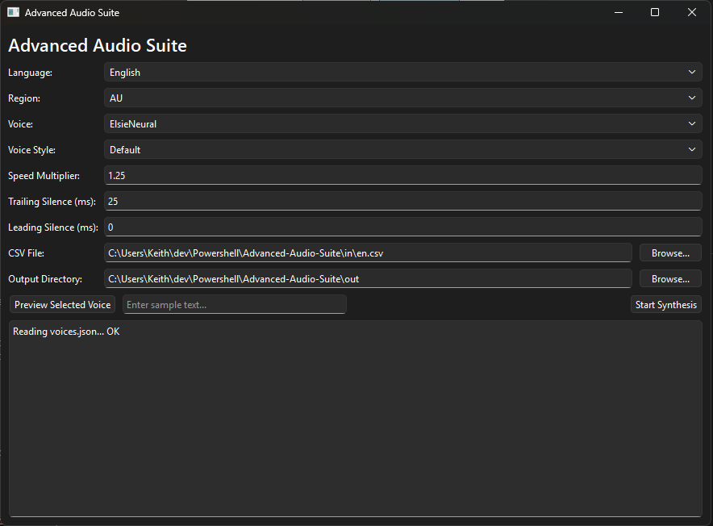

# Advanced Audio Suite for RC Transmitters

Desktop GUI app using Qt and Azure Speech SDK.



## Repository structure

- `AAS.py` - main GUI application
- `AAS.spec` - PyInstaller build spec
- `requirements.txt` - Python dependencies
- `in/` - input CSV files
- `samples/` - prebuilt sample packs
- `docs/` - docs/images

Runtime-generated folders (`config/`, `data/`, `out/`, `build/`, `dist/`) are created locally and ignored by git.

## FrSky audio CSV source

For FrSky users, default audio pack CSV files are available on FrSky's GitHub in the `audio` folder, under each language subfolder:

- https://github.com/FrSkyRC/ETHOS-Feedback-Community/blob/1.6/audio/

English example:

- https://github.com/FrSkyRC/ETHOS-Feedback-Community/blob/1.6/audio/en/en.csv

## Quick start (easiest)

From repo root, run one install script for your OS:

### Windows (PowerShell)

```powershell
.\install-windows.ps1
```

Then launch:

```powershell
.\.venv\Scripts\python.exe AAS.py
```

### Linux

```bash
chmod +x ./install-linux.sh
./install-linux.sh
```

Then launch:

```bash
./.venv/bin/python AAS.py
```

### macOS

```bash
chmod +x ./install-macos.sh
./install-macos.sh
```

Then launch:

```bash
./.venv/bin/python AAS.py
```

On first run, enter your Azure Speech key and region when prompted.  You can get them from the [Azure Portal](https://docs.azure.cn/en-us/ai-services/multi-service-resource?pivots=azportal).

## Build local binary (PyInstaller)

From repo root:

### Windows (PowerShell)

```powershell
.\.venv\Scripts\Activate.ps1
pip install pyinstaller
pyinstaller AAS.spec
```

### macOS / Linux (bash/zsh)

```bash
source .venv/bin/activate
pip install pyinstaller
pyinstaller AAS.spec
```

Build output:

- `dist/AdvancedAudioSuite.exe` (Windows)
- `dist/AdvancedAudioSuite` (macOS/Linux)

## Build for Windows, Linux, and macOS (GitHub Actions)

This repo includes a GitHub Actions workflow at `.github/workflows/build-cross-platform.yml`.

- Run it manually from the **Actions** tab (`Build cross-platform binaries`), or
- publish a new GitHub Release to trigger it automatically.

For an existing release tag, you can also run the workflow manually and provide the required `tag` input (for example `v1.0`) to attach binaries to that release.

Each run builds on:

- `windows-latest`
- `ubuntu-latest`
- `macos-latest`

Artifacts are uploaded per platform as:

- `AdvancedAudioSuite-windows.zip`
- `AdvancedAudioSuite-linux.tar.gz`
- `AdvancedAudioSuite-macos.app.zip`

When triggered by publishing a GitHub Release, those same files are also attached directly under the Release **Assets** section.
